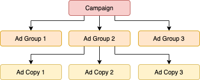

Advertising
===========

Overview
````````

NewScout comes with a built-in Ad Serving engine. We follow model similar to Google's



Key Entities
`````````````

Following entities are important to consider when creating Advertisement

1. `Advertisement`: This the Ad that gets served on NewScout across different section
2. `AdType`: For now this is default to `Text`, in future we will support Display
3. `AdGroup`: Collection of Advertisement is stored in `AdGroup`
4. `Campaign`: Collection fo `AdGroup`s is stored in Campaign 

Ad Serving Process
``````````````````

Right now the ad-serving is pretty simple, it looks from pool of active campains and evenly distributes the load