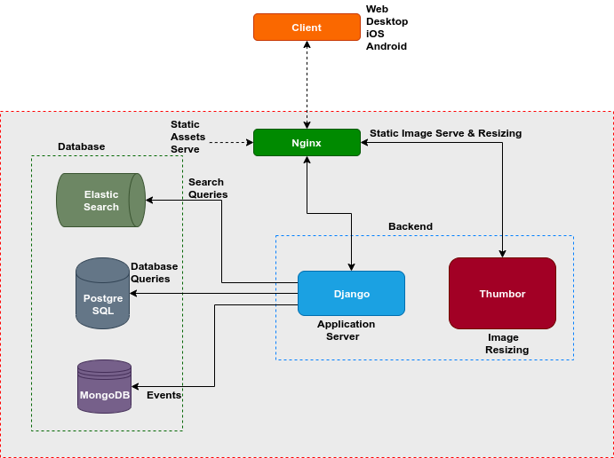

Architecture
============

Overview
````````

Objective of this article is to give high-level view of NewScout. NewScout was built keeping few things in mind:

1. `multi-tenancy`: You can run multiple properties from single/group of servers
2. `aggregation` vs `original story` use-cases: You can use NewScout to build your own Aggregator. It also support Publishing houses wanting to publish own stories.
3. `multi-lingual support`: NewScout was built to have multiple language support
4. `offline support`: We want our applications to be offline first, once synced the application should be able to work without connectivity.

NewScout is a collections of code-bases that allow to create and operate a Newsroom Application. Some of the key code bases include

1. `NewScout Web <https://github.com/fafadiatech/newscout_web>`_: API & Database Models are define in this repo.
2. `NewScout React Components <https://github.com/fafadiatech/newscout-react-components>`_ : Collection of Reusable ReactJS components. They are shared across Replay and Web code bases
3. `NewScout iOS App <https://github.com/fafadiatech/newscout_ios>`_: iOS Application codebase written in Swift
4. `NewScout Android App <https://github.com/fafadiatech/newscout_android>`_: Android Application written in Kotlin
5. `NewScout Replay <https://github.com/fafadiatech/newscout_replay>`_: Video player for use in Touch Table or Display devices


Technology Stack
````````````````



Following are some of the components that are used in NewScout

1. `Django <https://www.djangoproject.com/>`_: Webframework of choice used to build Web Application 
2. `Django REST Framework <https://www.django-rest-framework.org/>`_: Django package that makes building APIs easy
3. `Elastic Search <https://www.elastic.co/>`_: Indexer used to index articles
4. `MongoDB <https://www.mongodb.com/>`_: NoSQL used to store and generate all analytics
5. `Swagger UI <https://swagger.io/tools/swagger-ui/>`_: Used to build API documentation for project
6. `Sphinx <http://www.sphinx-doc.org/en/master/>`_: Documentation for the project is written using Sphinx
7. `ReactJS <https://reactjs.org/>`_: Frontend framework for NewScout
8. `Postgres <https://www.postgresql.org/>`_: Recommended DB for NewScout
9. `Thumbor <https://github.com/thumbor/thumbor>`_: Thumbor is used for Image Re-sizing


NewScout Web
````````````

NewScout contains collections of `application <https://docs.djangoproject.com/en/2.2/ref/applications/#module-django.apps>`_, we've organized our code based into

1. `core`: Contains core models and logic for NewScout
2. `advertising`: Allows to define and run different campaigns
3. `api`: Allow to access core models via API
4. `analytics`: Collections and visualization of data relating to NewScout
5. `dashboard`: App contains Dashboard for administration of the site
6. `event_tracking`: Track user-activities for generating reports

Key Models
``````````
Following are some of the key models for NewScout

`core`
~~~~~~

1. `Domain`: Using domain is how we implement multi-tenancy. Article model contains foreign key to `Domain`. 
2. `Category`: List of all Categories that an `Article` can be associated with
3. `CategoryAssociation`: `CategoryAssociation` allow us to arbitrarily nest `Category`, they store Parent and Child association
4. `Source`: Attribution to `Source` if `Article` is sourced from feed provider
5. `HashTag`: One `Article` can have one or more `HashTag`. This allows us to support multiple categories for same article
6. `BaseUserProfile`: Profile information of users who have signed-up
7. `Article`: Central entity of NewScout. This is what users interact with on Mobile Application
8. `ArticleMedia`: Images associated with article. Each `Article` can have more than one media
9. `Menu`: Top level Menu on Mobile Application
10. `SubMenu`: Sub-menu associated with `Menu`
11. `Devices`: Device related information, this is used for Push Notification
12. `DailDigest`: Personlized feed for Devices/Users based on their interaction history


`advertising`
~~~~~~~~~~~~~

1. `Campaign`: `Campaign` is collection of `AdGroup`. All scheduling and reporting is done at this unit.
2. AdGroup: `AdGroup` is collection of `Advertisement`
3. AdType: This is used to distinguish between Text and Image
4. Advertisement: This is actual unit that gets displayed/served
